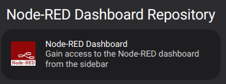

# Home Assistant Node-RED Dashboard addon

Gain access to the Node-RED dashboard from HA side menu.

> No need to open Node-RED webview port

## Detailed installation instructions
1. Navigate in your Home Assistant frontend to <kbd>Configuration</kbd> -> <kbd>Add-ons, Backups & Supervisor</kbd>
   -> <kbd>Add-ons</kbd> -> <kbd>ADD-ON STORE</kbd>.

2. Click the 3-dots menu at upper right <kbd>...</kbd> > <kbd>Repositories</kbd> and add this repository's URL: [https://github.com/regevbr/addon-node-red-dashboard](https://github.com/regevbr/addon-node-red-dashboard)

   

3. Scroll down the page to find the new repository, and click the new add-on named "Node-RED Dashboard"

   

4. Click <kbd>Install</kbd> and give it a few minutes to finish downloading.

5. Click <kbd>Start</kbd>, give it a few seconds to spin up, and then click the `Open Web UI` button that appears.
